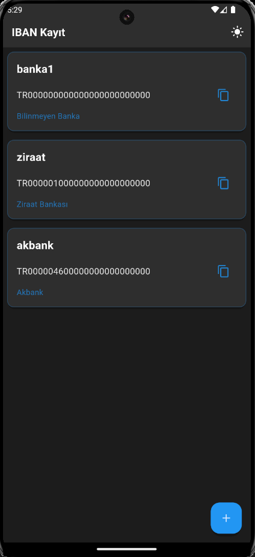
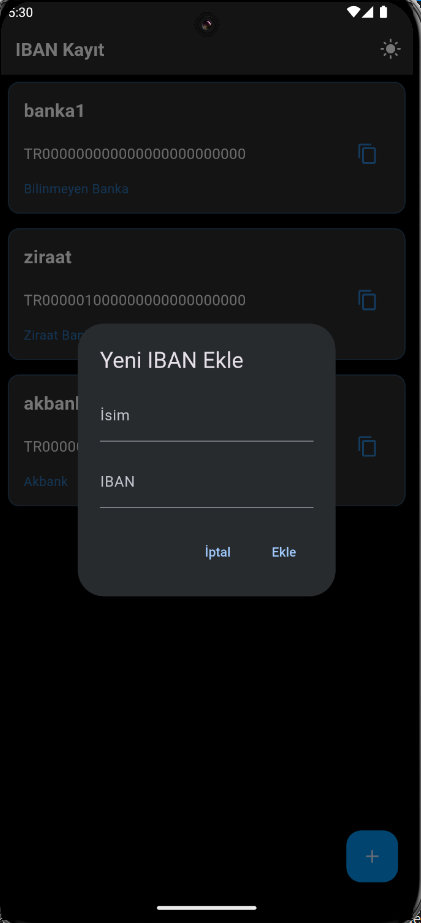
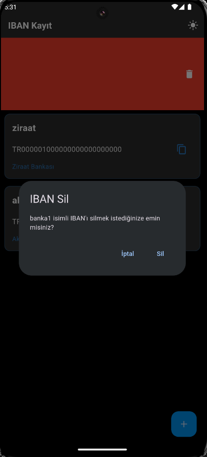

# IBAN Kayıt Uygulaması

Bu uygulama, IBAN numaralarınızı kolayca kaydetmenizi ve yönetmenizi sağlayan bir Flutter uygulamasıdır.

## 📥 Kurulum

## 📥 Uygulamayı İndir

[⬇️ app-release.zip dosyasını indir](https://github.com/ssevban/ibanapp/releases/download/v1.0.0/app-release.zip)

### Geliştirici Kurulumu
1. Projeyi klonlayın:
```bash
git clone https://github.com/kullaniciadi/iban-kayit.git
```

2. Bağımlılıkları yükleyin:
```bash
flutter pub get
```

3. Uygulamayı çalıştırın:
```bash
flutter run
```

## ✨ Özellikler

- 🌙 Dark Mode tasarım
- 📝 IBAN ve sahip bilgisi kaydetme
- 🏦 Otomatik banka adı tespiti
- 📋 Tek tıkla IBAN kopyalama
- ↕️ Sürükle-bırak ile sıralama
- ❌ Sola kaydırarak silme
- 💾 Yerel depolama ile veri saklama

## 📱 Ekran Görüntüleri

<table>
  <tr>
    <td></td>
    <td></td>
    <td></td>
  </tr>
</table>

## 📝 Kullanım

- IBAN eklemek için sağ alt köşedeki + butonuna tıklayın
- IBAN'ları yeniden sıralamak için kartları sürükleyip bırakın
- IBAN'ı kopyalamak için kart üzerindeki kopyala ikonuna tıklayın
- IBAN'ı silmek için kartı sola kaydırın

## 🛠️ Teknik Detaylar

- Flutter 3.x
- Provider state management
- SharedPreferences yerel depolama
- Material 3 tasarım

## 🤝 Katkıda Bulunma

1. Bu depoyu fork edin
2. Yeni bir branch oluşturun (`git checkout -b feature/yeniOzellik`)
3. Değişikliklerinizi commit edin (`git commit -am 'Yeni özellik: X'`)
4. Branch'inizi push edin (`git push origin feature/yeniOzellik`)
5. Pull Request oluşturun

## 📄 Lisans

Bu proje MIT lisansı altında lisanslanmıştır. Detaylar için [LICENSE](LICENSE) dosyasına bakın.